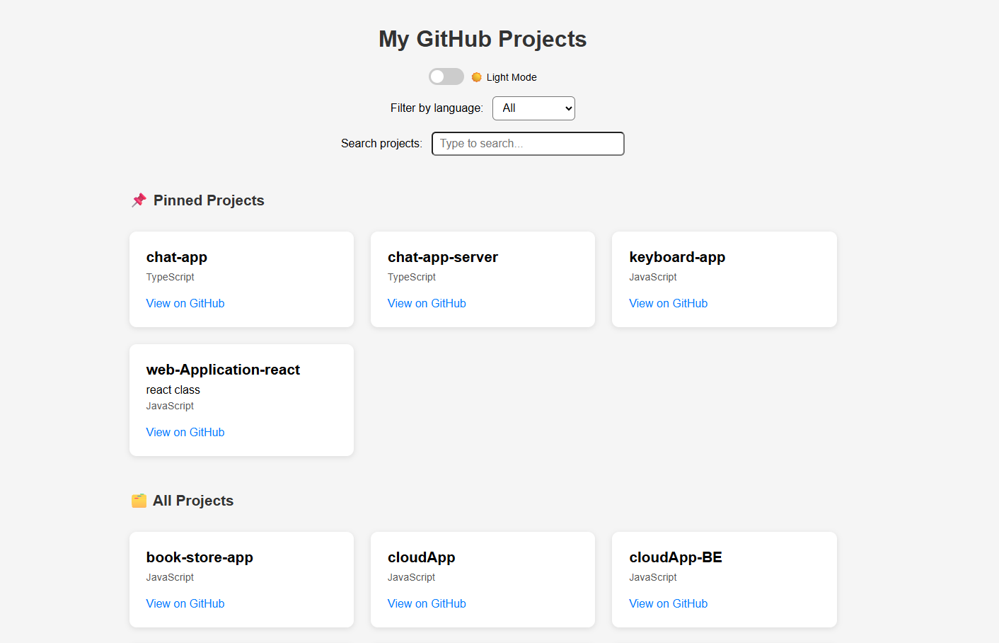
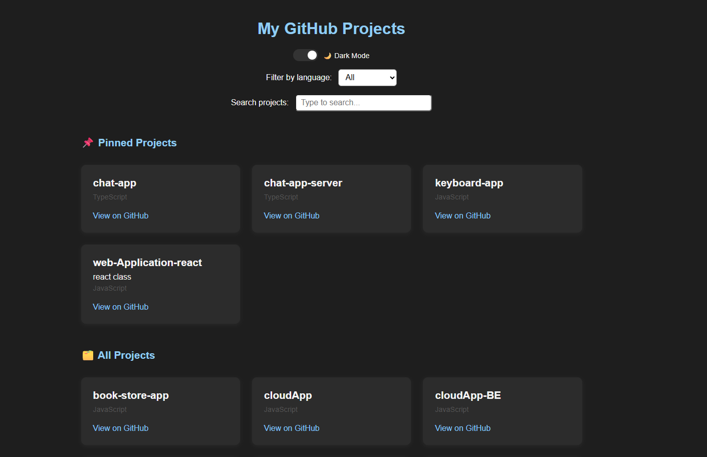

# 🚀 GitHub Portfolio Showcase

A full-stack portfolio project that displays all of my public GitHub repositories with filtering, search, dark mode, and a beautifully responsive UI.

## ✨ Features

- 🔄 Fetches data from the GitHub API
- 🔍 Filter projects by programming language
- 🔎 Search by project name or description
- 📌 Highlight pinned projects
- 🌙 Dark mode toggle
- 🎯 Clean, responsive layout

## 🖼️ Demo

## 🛠️ Tech Stack

### Frontend

- React (with Hooks)
- CSS (responsive grid, theming)
- Fetch API

### Backend

- Node.js
- Express
- Axios
- GitHub REST API
